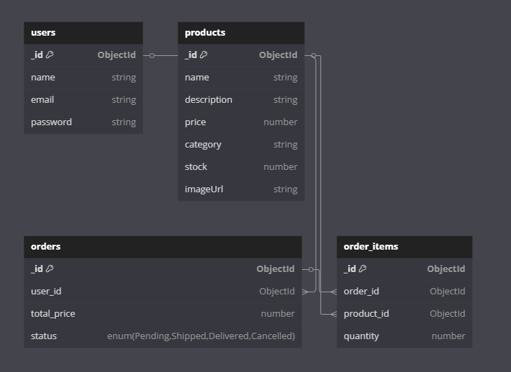

# 🛒 Online Store (REST API + MongoDB)

Welcome! This is a backend for an online store where you can:  
- Register and log in 🧑‍💻  
- Add products 🛍️  
- Create orders 📦  
- Work with MongoDB and JWT 🔐  

📌 **Technologies Used:**  
- **Node.js + Express** (Backend)  
- **MongoDB + Mongoose** (Database)  
- **JWT** (Authentication)  
- **bcryptjs** (Password Hashing)  

---

## 🚀 1. How to Run the Project?

### **1️⃣ Install Node.js and MongoDB**
If you don’t have them installed:  
- **[Download Node.js](https://nodejs.org/)**  
- **[Download MongoDB](https://www.mongodb.com/try/download/community)**  

### **2️⃣ Clone the Project**

git clone https://github.com/tekasgf/project
cd online-store

### **3️⃣ Install Dependencies**
npm install

### **4️⃣ Create a .env File**
PORT=3000
MONGO_URI=mongodb://localhost:27017/online-store
JWT_SECRET=supersecretkey

### **5️⃣ Start the Server**
npm run dev

✅ MongoDB connected
🚀 Server running on port 3000

## 2. API Endpoints (How to Use?)

### **Register a User (POST /users/register)**
{
  "name": "Alice",
  "email": "alice@example.com",
  "password": "123456"
}

### **User Login (POST /users/login)**
{
  "email": "alice@example.com",
  "password": "123456"
}

Response:
{
  "token": "..."
}

### **Add a Product (POST /products)**
{
  "name": "Laptop",
  "description": "Powerful laptop",
  "price": 1000,
  "stock": 10
}

### **Create an Order (POST /orders)**
{
  "items": [
    {
      "product_id": "603d7b7f6f1e2b3a3c4a7e3b",
      "quantity": 2
    }
  ]
}

## 3. Additional Information

### **How to Import Sample Products?**
node scripts/importData.js

## 4. ERD Database Schema
 
Collection Structure:

users (Users)
products (Products)
orders (Orders)
order_items (Order-Product Relationship)

## Authors

Talgat
IT-2306
https://github.com/tekasgf/project
